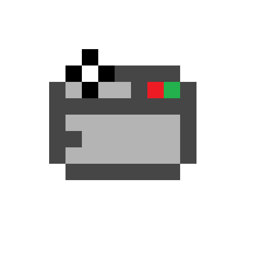

  

  # FrogCam

## About

FrogCam is based off of the [FogCam](https://fogcam.org/) project. It is a simple webcam that captures an image every 20 seconds.

Frogcam uses [FrogPhone](https://github.com/eamonwatson/frogphone) as video feed, it captures an image from the feed every 20 seconds which it then shows on the webpage.

## License

This project is licensed under the MIT [LICENSE](./LICENSE.md).
